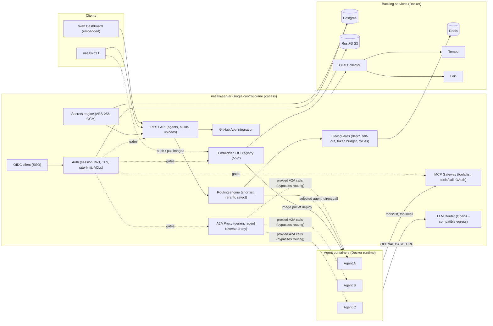
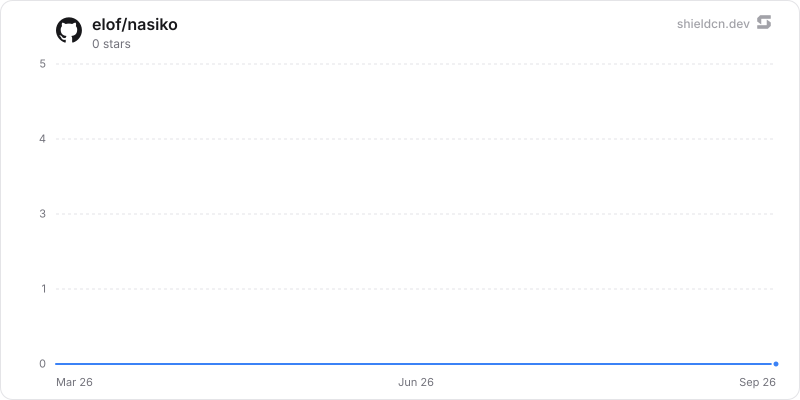

**Nasiko is the OpenRuntime for agents, coding harnesses, frameworks and tools.**<br />
Find the coding agents already running. See what each one costs, by harness and model. Route them to the models you choose while developers keep using their existing harness workflows.

**[📚 Documentation](https://docs.nasiko.com)**  •  **[💬 Discord](https://discord.com/invite/HmnfkTfjFv)**  •  **[🐛 Report a bug](https://github.com/Nasiko-Labs/nasiko/issues)**


[](https://github.com/Nasiko-Labs/nasiko/stargazers)
[](https://github.com/Nasiko-Labs/nasiko/network/members)
[](https://github.com/Nasiko-Labs/nasiko/releases)
[](https://github.com/Nasiko-Labs/nasiko/blob/main/LICENSE)

[](https://github.com/Nasiko-Labs/nasiko)
[](https://github.com/Nasiko-Labs/nasiko/issues)
[](https://github.com/Nasiko-Labs/nasiko/pulls)
[](https://github.com/Nasiko-Labs/nasiko/actions)
[](https://github.com/Nasiko-Labs/nasiko/pulls)

## Table of Contents

- [What is Nasiko?](#what-is-nasiko)
- [Start here: see what is already running](#start-here-see-what-is-already-running)
- [Coding agents: reporting and routing](#coding-agents-reporting-and-routing)
- [Features](#features)
- [Why this runs in the call path](#why-this-runs-in-the-call-path)
- [Architecture](#architecture)
- [Requirements](#requirements)
- [Quick Start: Docker only (no Rust needed)](#quick-start-docker-only-no-rust-needed)
- [Setup guides by operating system](#setup-guides-by-operating-system)
- [Deploying your own agents](#deploying-your-own-agents)
- [Environment Variables](#environment-variables)
- [Project Structure](#project-structure)
- [Troubleshooting](#troubleshooting)
- [Project Activity](#project-activity)
- [Documentation & Links](#documentation--links)
- [Support](#support)
- [Contributing](#contributing)
- [License](#license)

## What is Nasiko?

Your developers are already running coding agents. Claude Code, Codex, Cursor, OpenCode, often
more than one at a time, each with its own dashboard and its own billing unit. At the end of the
month there is a real bill, and nobody can say who spent it, on which model, or what it produced.

Nasiko finds those agents, puts their spend in one schema, and hands back the model choice the
harness made for you. An OpenRuntime belongs to no vendor inside it: your cost history, your policy
and your model choice stay with you rather than with whichever harness you happened to install.

Two properties hold the rest of this together, and they are not the same thing.

**Non-invasive discovery** is about your architecture. Nasiko can detect the harnesses you already
run without changing their configuration. Reporting and routing are explicit opt-ins that add hooks
or update harness settings, but they require no wrapper or SDK in your application code.

**Non-intrusive operation** is about your day. After one-time setup, developers keep using the same
harness commands and interfaces. OpenCode must be restarted after its plugin is installed, and
Codex asks you to trust the new Nasiko hooks.

<br />
**Nasiko Dashboard**: deploy agents, route traffic, manage tools, and watch traces.

## Start here: see what is already running

Install the current CLI from this checkout, then run its read-only discovery command:

```sh
git clone https://github.com/Nasiko-Labs/nasiko.git && cd nasiko
cargo install --path cli/ --force
nasiko agents discover
```

`nasiko agents discover` reads your machine, prints what it finds, and exits. You get a row per
supported harness: whether it is detected, whether it is reporting to Nasiko, its version, and
where its config lives. Discovery changes no harness settings, requires no account, and sends
nothing off the machine.

> If `nasiko agents discover` is not listed by `nasiko agents --help`, reinstall with the
> `--force` command above. Older builds use the same `0.1.0` version number, so `nasiko --version`
> alone cannot tell you whether the command is present.


| Harness     | Discovery and session reporting | LLM routing |
| ----------- | ------------------------------- | ----------- |
| Claude Code | yes                             | yes         |
| Codex       | yes                             | yes         |
| OpenCode    | yes                             | yes         |
| Cursor CLI  | yes                             | not yet     |


Those four are the supported set today and we will continue to add support for me. If you have a request please create an issue!

> The CLI is a Rust crate, so this path needs [Rust](https://rustup.rs). Reporting and routing also
> need an active control plane and valid login: see
> [Quick Start](#quick-start-docker-only-no-rust-needed).

## Coding agents: reporting and routing

Nasiko manages the coding-agent CLIs already installed on your machine: it can record what they
do, route their LLM calls, or both. The two are independent opt-ins. `agents uninstall` removes
local reporting hooks but preserves the registered agent and its history; `disconnect` restores
routing settings, though a running harness may need to be stopped or disconnected with `--force`.

### Session reporting

```sh
nasiko agents discover           # DETECTED / CONNECTED / VERSION / CONFIG per agent
nasiko agents install <agent>    # claude, codex, opencode, or cursor
nasiko agents install <agent> --no-content  # omit prompt and response text
nasiko agents uninstall <agent>
nasiko agents sync               # flush queued session-turn events to the control plane
```

Auto-install also fires on `nasiko connect <control-plane-url>`, `nasiko use`, and
`nasiko auth login`, but only when authenticated and only for agents with **no existing install
record**. Routing commands such as `nasiko connect claude` do not trigger auto-install. Nasiko never
silently rebinds an already-installed agent to a new cluster; rebind explicitly with
`nasiko agents install <agent>`.

Nasiko installs each harness's supported event hooks: Claude uses `Stop`, OpenCode reports on
`session.idle`, and Codex and Cursor use their richer hook event sets. Completed turns are queued
locally under `~/.nasiko/integrations/queue/` and delivered to
`POST /api/telemetry/coding-agent/events/batch`, so a control plane that is briefly unreachable
costs you nothing. Permanently-failed deliveries (after a cluster is deleted or renamed, say) land
in `~/.nasiko/integrations/rejected/` and are safe to delete.

Ingested turns show up as chat sessions right away (`nasiko sessions`, `nasiko history <id>`).
Traces, token counts, and cost additionally require `CODING_AGENT_OTLP_ENDPOINT`, covered below.

### Routing: give the harness back the model choice

Some harnesses arrive tied to a provider by default. Claude Code defaults to Anthropic; Codex
defaults to OpenAI. That choice arrived with the tool rather than with you.

Register a provider and key with Nasiko once, then point a harness at Nasiko instead of at its
vendor. Inbound wire protocol and outbound provider are decoupled, so an Anthropic-format request
from Claude Code is served by your OpenAI key:

```sh
nasiko llm-config create --name my-openai --provider openai --model gpt-4o \
  --api-key-secret OPENAI_API_KEY --secret-value "$OPENAI_API_KEY"
nasiko connect claude --config my-openai
```

The full set of bindings:

```sh
nasiko connect claude --config <llm-config-name>
nasiko connect codex --config <llm-config-name>
nasiko connect opencode --config <llm-config-name>
nasiko disconnect <agent>        # reverse the settings/plugin changes
nasiko status <agent>            # show current binding
```

`connect claude` configures Claude Code's `apiKeyHelper` and `ANTHROPIC_BASE_URL`. `connect codex`
adds a `model_providers.nasiko` entry and command-based auth to Codex's `config.toml`. Their
credential helpers obtain a one-hour JWT from `POST /api/agents/{id}/llm-token`; Codex refreshes
its credential on a timer rather than minting one for every request. Claude Code sends the
credential in the `x-api-key` header rather than `Authorization`; the router accepts both.

`connect opencode` instead installs `plugins/nasiko-llm-router.js` under OpenCode's config
directory (respecting `OPENCODE_CONFIG_DIR` and `XDG_CONFIG_HOME`), registers a `nasiko` provider,
and makes `nasiko/router` the default model for **new** OpenCode sessions only. OpenCode fixes a
session's model at creation time in its own database, so resuming an existing session will not
route it. Start a new one, or pick "Nasiko Router" explicitly.

Inbound wire protocol and outbound provider are fully decoupled: `nasiko connect claude --config my-openai-config` routes Claude Code's Anthropic-format traffic to OpenAI.

> `~/.claude/settings.json` and OpenCode's config are per-user, global files. Connecting an agent
> affects every Claude Code / OpenCode process on the machine, not just the current project.

### LLM config management

```sh
nasiko llm-config create --name <name> --provider <provider> --model <model>
nasiko llm-config list
nasiko llm-config update <name> [--provider ...] [--model ...]
nasiko llm-config set-default <name>
nasiko llm-config attach <name> --agent <agent>     # attach to a deployed agent
nasiko llm-config detach --agent <agent>
nasiko llm-config get <agent>                       # resolved routing config for an agent
nasiko llm-config providers                         # valid provider/model values + pricing
```

Set a config's `model` for predictable routing. If it is unset, the router falls back through tier
models and then the platform default; `list` shows `provider/?` for the unset value.

### Server configuration


| Variable                     | Purpose                                                                                                                                                                                                                    |
| ---------------------------- | -------------------------------------------------------------------------------------------------------------------------------------------------------------------------------------------------------------------------- |
| `AGENT_JWT_SECRET`           | Signs the short-lived per-request router JWTs. Empty ⇒ every router request is rejected with 401 (fail-closed).                                                                                                            |
| `CODING_AGENT_OTLP_ENDPOINT` | OTLP/HTTP JSON base endpoint for the telemetry outbox worker (the server appends `/v1/traces` and `/v1/logs`). Unset leaves ingested receipts pending and starts no worker, so coding-agent traces never reach Tempo/Loki. |


## Features

Three things break first when an agent estate grows: spend nobody can attribute, permissions nobody
can enumerate, and a fleet nobody can run as one system. The feature set is grouped accordingly.

### TokenOps


| Feature                        | What it does                                                                                                                                                                                    |
| ------------------------------ | ----------------------------------------------------------------------------------------------------------------------------------------------------------------------------------------------- |
| **LLM Router**                 | Agents get an `OPENAI_BASE_URL` and a short-lived identity token instead of a real key. The router resolves provider, model, and key server-side. No agent and no log ever sees a real API key. |
| **Cost and token attribution** | Usage and cost are collected from `gen_ai.`* span attributes and broken out per agent and per model, rather than arriving as a single provider invoice you have to reverse-engineer.            |
| **One trace per interaction**  | Every dispatch and proxy hop emits a real OTel span, so a request is one end-to-end trace across every agent hop, with cost attached.                                                           |


### Policy, security, and governance


| Feature                                          | What it does                                                                                                                                                                                                     |
| ------------------------------------------------ | ---------------------------------------------------------------------------------------------------------------------------------------------------------------------------------------------------------------- |
| **Single ingress, always proxied**               | Agents are never publicly reachable. Every agent-to-agent call is proxied through the server, so limits and tracing apply at every hop rather than only the first.                                               |
| **Access control, for agents as well as people** | User-to-agent ownership and grants, plus an agent-to-agent allowlist. The two gate every proxy call independently.                                                                                               |
| **MCP Gateway**                                  | One permanent URL gives every agent a merged, permission-filtered view of Composio toolkits and custom MCP servers, without the agent ever holding the credentials. An agent discovers only what it was granted. |
| **Flow guards**                                  | Redis-backed cascade limits (depth, fan-out, token budget, timeout, cycle detection) stop a loop between two agents from quietly consuming your budget.                                                          |
| **Encrypted secrets**                            | Per-agent secrets are encrypted at rest with AES-256-GCM and injected only at deploy time, so they stay out of your repo.                                                                                        |


### Orchestration


| Feature                             | What it does                                                                                                                                                     |
| ----------------------------------- | ---------------------------------------------------------------------------------------------------------------------------------------------------------------- |
| **Deploy anything that speaks A2A** | `nasiko deploy` builds, pushes to the embedded registry, and runs it. No external registry required, and no SDK to adopt.                                        |
| **Intelligent routing engine**      | A 3-stage pipeline: shortlist by embedding similarity, rerank on conversation context, then an LLM makes the final pick. Callers do not need to know your fleet. |
| **Embedded OCI registry**           | Self-hosted, S3-backed, with layer dedup, so `nasiko push` and `nasiko deploy` need nothing external.                                                            |
| **CLI-first, no lock-in**           | `nasiko new`, `run`, `chat`, `deploy`. Bring your own LLM provider, and change it later.                                                                         |


## Why this runs in the call path

There is no version of this that works from the outside, and saying so plainly is the shortest way
to explain the architecture below.

Every coding-agent vendor meters in its own private unit, and none of them offers an ingest
endpoint for another vendor's usage. There is no invoice reconciliation that produces one number,
and no procurement policy that produces one either. To attribute spend across vendors you have to
be in the path where the calls happen.

Enforcement has the same shape. A budget cap or a tool allowlist is only real if it sits where the
request goes, rather than in a review meeting or in an environment variable a developer can unset.

That constraint is what the next section is a picture of.

## Architecture

Nasiko is a **single process** with no separate gateway. Every inter-agent call is proxied back
through the server, the single chokepoint where flow limits, ACLs, and observability are enforced.
Durable state lives in **Postgres**, **Redis**, and **S3** (RustFS), with optional observability via
**Tempo / Loki / the OTel Collector**.




> Every request to an agent is either dispatched by the routing engine or proxied generically, and both
> paths originate **inside** the server. Agents never receive a direct, public request, and both call
> back out into the LLM Router and MCP Gateway rather than holding real API keys or tool credentials.

## Requirements


| Component                      | Minimum version                                                                                        | Why                                                                                                                                                                                    |
| ------------------------------ | ------------------------------------------------------------------------------------------------------ | -------------------------------------------------------------------------------------------------------------------------------------------------------------------------------------- |
| **Docker Engine + Compose V2** | Compose V2 plugin (the `docker compose` command, not the legacy standalone `docker-compose` v1 binary) | `docker-compose.yml` uses the extended `depends_on: condition: service_healthy` syntax; the Docker-only path needs nothing else.                                                       |
| **Rust**                       | 1.85+ (stable)                                                                                         | The workspace targets `edition = "2024"` (see `[Cargo.toml](Cargo.toml)`), stabilized in Rust 1.85, and is only needed for the CLI / Path B developer setup, not the Docker-only path. |


## Quick Start: Docker only (no Rust needed)

The fastest way to run Nasiko requires **only [Docker](https://docs.docker.com/get-docker/)** (with Compose).
The server builds itself from source inside Docker.

### 1. Clone and configure

```sh
git clone https://github.com/Nasiko-Labs/nasiko.git
cd nasiko
cp .env.example .env
```

Edit `.env` and set at minimum:

- `OPENAI_API_KEY`: your OpenAI key (used by the routing engine and injected into agents)
- `ADMIN_PASSWORD`: password for the bootstrap admin account

### 2. Start the platform

```sh
docker compose up -d
```

This builds the server image and starts the full stack:
**Postgres · Redis · RustFS (S3) · OTel Collector · Tempo · Loki · nasiko-server**.

- First build takes a few minutes (compiles Rust inside Docker), and subsequent builds are fast.
- Open **[http://localhost:8080](http://localhost:8080)** for the dashboard and log in with `ADMIN_USERNAME` / `ADMIN_PASSWORD`
(default `admin` / `changeme`).

```sh
docker compose logs -f server   # follow server logs
docker compose down             # stop everything
docker compose up -d --build    # rebuild after pulling new changes
```

---

> No Docker? Use the [Developer / Rust setup](#path-b--developer--rust-setup) below.

## Setup guides by operating system

You have **two supported paths**:


| Path                 | Requires      | Best for                                  |
| -------------------- | ------------- | ----------------------------------------- |
| **A. Docker-only**   | Docker only   | Anyone who just wants to run the platform |
| **B. Source / Rust** | Rust + `just` | Contributors, developers, hot-reload      |


### Path A: Docker-only

**Windows**

1. Install **Docker Desktop** -> [https://www.docker.com/products/docker-desktop/](https://www.docker.com/products/docker-desktop/)
2. Open Docker Desktop and wait until the engine is running.
3. In a terminal (PowerShell or Git Bash):
  ```powershell
   git clone https://github.com/Nasiko-Labs/nasiko.git
   cd nasiko
   Copy-Item .env.example .env
   # edit .env -> set OPENAI_API_KEY and ADMIN_PASSWORD
   docker compose up -d
  ```
4. Open [http://localhost:8080](http://localhost:8080) and log in.

> Windows troubleshooting: see the [Troubleshooting](#troubleshooting) section (port conflicts,
> line endings, encryption key, WSL, Docker Desktop).


**macOS**

1. Install **Docker Desktop for Mac** -> [https://www.docker.com/products/docker-desktop/](https://www.docker.com/products/docker-desktop/)
2. Open Docker Desktop until the engine is running.
3. In Terminal:
  ```sh
   git clone https://github.com/Nasiko-Labs/nasiko.git
   cd nasiko
   cp .env.example .env
   # edit .env -> set OPENAI_API_KEY and ADMIN_PASSWORD
   docker compose up -d
  ```
4. Open [http://localhost:8080](http://localhost:8080) and log in.

> `host.docker.internal` resolves out of the box on Docker Desktop (macOS + Windows), so agents can
> reach the MCP gateway without extra setup.


**Linux**

1. Install Docker engine + Compose plugin -> [https://docs.docker.com/engine/install/](https://docs.docker.com/engine/install/)
2. Add your user to the `docker` group and re-login:
  ```sh
   sudo usermod -aG docker "$USER"
   newgrp docker
  ```
3. In a terminal:
  ```sh
   git clone https://github.com/Nasiko-Labs/nasiko.git
   cd nasiko
   cp .env.example .env
   # edit .env -> set OPENAI_API_KEY and ADMIN_PASSWORD
   docker compose up -d
  ```
4. Open [http://localhost:8080](http://localhost:8080) and log in.

> **Linux note:** native Docker does **not** provide `host.docker.internal` automatically. If agents
> report `[Errno -2] Name or service not known`, run Docker with
> `--add-host host.docker.internal:host-gateway` or set `MCP_GATEWAY_PUBLIC_URL` to the bridge IP
> (see [Troubleshooting](#troubleshooting)).


### Toolchain setup: Rust, `just`, etc. (for the CLI / Path B)

**Windows**

```powershell
# 1. Rust (installs rustup + stable toolchain)
winget install --id Rustlang.Rustup -e
# (reopen your terminal, then verify)
rustc --version; cargo --version

# 2. `just` command runner + cargo-watch (after Rust is installed)
cargo install just cargo-watch

# 3. If you plan to build native Windows binaries, also install the C++ linkers:
winget install Microsoft.VisualStudio.2022.BuildTools --override "--wait --quiet --add Microsoft.VisualStudio.Workload.VCTools --includeRecommended"
```

> Building the CLI **does not** require the C++Build Tools, since it uses a pure-Rust toolchain. The
> C++ linkers are only needed if native crates (e.g. `ring`) fail to link on the MSVC toolchain.


**macOS**

```sh
# 1. Xcode Command Line Tools (provides the C toolchain/linker)
xcode-select --install

# 2. Rust
curl --proto '=https' --tlsv1.2 -sSf https://sh.rustup.rs | sh
source "$HOME/.cargo/env"

# 3. `just` + cargo-watch
cargo install just cargo-watch
```


**Linux (Debian/Ubuntu)**

```sh
# 1. Build dependencies (cc, OpenSSL)
sudo apt update && sudo apt install -y build-essential pkg-config libssl-dev

# 2. Rust
curl --proto '=https' --tlsv1.2 -sSf https://sh.rustup.rs | sh
source "$HOME/.cargo/env"

# 3. `just` + cargo-watch
cargo install just cargo-watch

# 4. Docker engine + compose (if not using Docker Desktop)
#    See https://docs.docker.com/engine/install/ubuntu/
```


After setup, verify everything:

```sh
rustc --version   && cargo --version
just --version
docker --version  && docker compose version
```

### Path B: Developer / Rust setup

Requires **[Rust (rustup)](https://rustup.rs)**, `**[just](https://github.com/casey/just)`**
(`cargo install just`), and **Docker**.

```sh
# 1. Start infrastructure only (Postgres, Redis, RustFS, OTel stack)
just infra

# 2. Configure the server env
cp server/.env.example server/.env
# edit server/.env -> set OPENAI_API_KEY at minimum

# 3. Run the server natively (hot-reload)
just dev
# ...or without hot-reload:
just run
```

The server runs on [http://localhost:8080](http://localhost:8080). `just dev` auto-rebuilds on changes (needs
`[cargo-watch](https://github.com/watchexec/cargo-watch)`).

Useful dev commands:

```sh
just check        # cargo check --workspace
just clippy       # lint (zero-warnings policy)
just test-unit    # fast hermetic unit tests (no infra needed)
just test         # unit + integration tests (needs: just infra)
```

Building from source:

```sh
cargo build --release -p nasiko          # CLI binary
cargo build --release -p nasiko-server   # Server binary
```

## Deploying your own agents

Past the coding agents you already run, Nasiko deploys agents you write yourself. They can be in
Python, Rust, Go, or TypeScript. At runtime they must speak
[A2A](https://github.com/a2aproject/a2a-spec) v1.0 exactly; source deployments also include an
`AgentCard.json` and `Dockerfile` for metadata and packaging. Nasiko hardcodes the
`A2A-Version: 1.0` header on every outbound A2A request, so the target agent must accept the v1.0
wire format. See `[docs/A2A_PROTOCOL.md](docs/A2A_PROTOCOL.md)` for the detail. There is no
proprietary agent format and no SDK to adopt.

This path needs **Rust** to build the CLI from source (it is a separate `cli/` crate).
[Docker](https://docs.docker.com/get-docker/) is required for local image builds; `nasiko upload`
instead sends source to the server to build and deploy without local Docker.

### Install the CLI

```sh
# from the repo root
cargo install --path cli/ --force
# ...or build a standalone binary
cargo build --release -p nasiko
```

Add it to your `PATH` if it is not already (Cargo's `bin` dir: `~/.cargo/bin`).

### Deploy your first agent

```sh
nasiko connect http://localhost:8080
nasiko auth login                          # log in with ADMIN_USERNAME / ADMIN_PASSWORD
nasiko new openai my-agent && cd my-agent  # scaffold from a template
nasiko deploy .                            # build, push, and deploy
nasiko chat "Hello there"                  # talk to your agent (message must contain a space,
                                            # or use --agent: nasiko chat --agent my-agent "Hello")
```

You can also deploy agents directly from the dashboard UI: upload source, import from GitHub, or
pull from the artifact registry.

### Handy CLI commands


| Command                                           | Description                                                           |
| ------------------------------------------------- | --------------------------------------------------------------------- |
| `nasiko connect <url>`                            | Register a control plane and switch to it                             |
| `nasiko auth login`                               | Authenticate with the active cluster                                  |
| `nasiko new [template] [name]`                    | Scaffold a new agent project                                          |
| `nasiko build` / `nasiko run`                     | Build the agent image / build + run it locally                        |
| `nasiko push` / `nasiko deploy <image>`           | Push image / build-push-deploy to the cluster                         |
| `nasiko upload [source]`                          | Upload source; the server builds it (no local Docker)                 |
| `nasiko ps`                                       | List running agents                                                   |
| `nasiko logs <agent> -f`                          | Stream (and follow) agent logs                                        |
| `nasiko stop` / `start` / `restart` / `scale <n>` | Agent lifecycle                                                       |
| `nasiko rm --name <agent>`                        | Terminate + deregister an agent (positional `id` only accepts a UUID) |
| `nasiko chat <agent>`                             | Interactive or one-shot A2A chat                                      |
| `nasiko secrets set`                              | Configure encrypted per-agent secrets                                 |
| `nasiko mcp`                                      | Manage MCP Gateway connectors and tool permissions                    |
| `nasiko observe`                                  | Observability: sessions, traces, spans, stats, FinOps                 |
| `nasiko maf`                                      | Multi-agent flow workflows (create/run/inspect)                       |
| `nasiko registry`                                 | Browse the artifact registry                                          |
| `nasiko github`                                   | GitHub integration (status/repos/connect/disconnect/clone)            |


Run `nasiko --help` for the full, workflow-ordered command list.

## Environment Variables

Everything is env-driven through a single `Config` struct (`config/src/lib.rs`); required keys fail
fast at startup. When running via `docker compose`, the infrastructure URLs (`DATABASE_URL`,
`REDIS_URL`, `S3_ENDPOINT`, OTel/Tempo/Loki, agent network) are set automatically by
`docker-compose.yml`. See `[.env.example](.env.example)` for every variable with descriptions.


| Variable                                                                       | Purpose                                                       | Default                           |
| ------------------------------------------------------------------------------ | ------------------------------------------------------------- | --------------------------------- |
| `OPENAI_API_KEY`                                                               | LLM provider for the router + agents                          | optional (`sk-...`)               |
| `SECRETS_ENCRYPTION_KEY`                                                       | Base64 32-byte AES-256-GCM key                                | **required**                      |
| `ADMIN_USERNAME` / `ADMIN_PASSWORD`                                            | Bootstrap admin account                                       | `admin` / `changeme`              |
| `JWT_SECRET`                                                                   | JWT signing secret                                            | **required**                      |
| `S3_BUCKET` / `S3_ACCESS_KEY` / `S3_SECRET_KEY` / `S3_REGION`                  | S3 storage for the OCI registry                               | set by compose                    |
| `AGENT_RUNTIME`                                                                | Container runtime (`docker` in OSS)                           | `docker`                          |
| `DATABASE_URL` / `REDIS_URL` / `S3_ENDPOINT`                                   | Infra connections                                             | set by compose                    |
| `COMPOSIO_API_KEY`                                                             | Composio platform (MCP toolkits)                              | optional                          |
| `SEED_TOOLKITS`                                                                | Composio toolkits to auto-register at boot                    | optional                          |
| `MCP_GATEWAY_PUBLIC_URL`                                                       | Public URL injected into agents for the MCP gateway           | set by compose                    |
| `SEED_AGENTS`                                                                  | Space-separated images auto-deployed at boot                  | optional                          |
| `AGENT_JWT_SECRET`                                                             | Signs coding-agent LLM-router request tokens                  | **required for `nasiko connect`** |
| `CODING_AGENT_OTLP_ENDPOINT`                                                   | OTLP/HTTP JSON endpoint for the coding-agent telemetry outbox | unset (worker disabled)           |
| `ROUTER_MODEL` / `EMBEDDING_MODEL`                                             | Routing-engine models                                         | see `config/`                     |
| `NASIKO_FLOW_MAX_DEPTH` / `NASIKO_FLOW_MAX_FAN_OUT` / `NASIKO_FLOW_MAX_TOKENS` | Flow-guard cascade limits                                     | see `config/`                     |


## Project Structure

```
server/         Control plane: Axum routes, auth, agent proxy, build worker, embedded UI
orchestrator/   Routing engine: semantic agent selection (shortlist, rerank, select)
mcp-gateway/    MCP Gateway: connectors, tool aggregation, per-agent permissions, OAuth
llm-router/     Provider-agnostic OpenAI-compatible egress proxy for agent LLM calls
runtime/        ContainerRuntime trait + DockerRuntime (bollard)
auth/           AuthService trait + OSS implementation (JWT login, RBAC hooks)
flow/           FlowGuard: anti-DoS cascade limits + live flow events
secrets/        AES-256-GCM encryption for agent secrets at rest
oci/            Embedded OCI Distribution v2 registry (S3-backed, layer dedup)
observability/  OTel init, Tempo/Loki clients, DB-backed model pricing
agent-proxy/    Agent ID -> running-container endpoint resolution
github/         GitHub OAuth + repo import for source-based deploys
types/          A2A protocol + registry types
config/         Single env-driven Config struct
utils/          Shared helpers
cli/            nasiko binary (agent developer CLI, sync HTTP via ureq)
agents/         Example and seed agents (each a standalone A2A container)
migrations/     Postgres migrations (sqlx, run automatically at startup)
ui/             Frontend (vanilla JS web components, embedded in the server binary)
docs/           Design docs (architecture, protocol, conventions)
```

## Troubleshooting

### Quick fixes: one command


| Problem                                                            | One command                                                                                                                                                                                                      |
| ------------------------------------------------------------------ | ---------------------------------------------------------------------------------------------------------------------------------------------------------------------------------------------------------------- |
| CLI won't compile: `link.exe not found` / `cc not found` (Windows) | Use the Docker-only path, or `winget install Microsoft.VisualStudio.2022.BuildTools --override "--wait --quiet --add Microsoft.VisualStudio.Workload.VCTools --includeRecommended"` then reopen the terminal     |
| CLI won't compile: `dlltool ... Invalid bfd target`                | `winget install MSYS2.MSYS2` then add `C:\msys64\mingw64\bin` to PATH ahead of `C:\MinGW`, or switch to MSVC                                                                                                     |
| `: command not found` when sourcing `.env`                         | `sed -i 's/\r$//' server/.env`                                                                                                                                                                                   |
| `invalid SECRETS_ENCRYPTION_KEY` at startup                        | `sed -i.bak "s/^SECRETS_ENCRYPTION_KEY=.*/SECRETS_ENCRYPTION_KEY=$(openssl rand -base64 32)/" .env`                                                                                                              |
| `address already in use` on ports 9000/4317/4318                   | Stop Docker Desktop, then `wsl --shutdown` (Windows) and rerun `docker compose up -d`                                                                                                                            |
| `permission denied` on Docker socket                               | `sudo usermod -aG docker "$USER" && newgrp docker` (*nix/WSL)                                                                                                                                                    |
| WSL `ext4.vhdx: path not found`                                    | `wsl --unregister Ubuntu && wsl --install -d Ubuntu`                                                                                                                                                             |
| Agent upload -> `500 agents_owner_id_fkey`                         | Log out and back in, or `docker compose down -v && docker compose up -d` then log in fresh                                                                                                                       |
| Server can't reach Postgres                                        | `docker compose up -d` and wait for `healthy`                                                                                                                                                                    |
| Agent `Name or service not known` (Linux Docker)                   | Recreate with `--add-host host.docker.internal:host-gateway`                                                                                                                                                     |
| `SEED_TOOLKITS is set but COMPOSIO_API_KEY is not` at startup      | Expected and harmless: `SEED_TOOLKITS` ships active by default in `.env.example`. Set `COMPOSIO_API_KEY` in `.env` to actually register Composio toolkits, or comment out `SEED_TOOLKITS` to silence the warning |


### Windows


| Symptom                                                              | Cause / fix                                                                                                                                                                                                                            |
| -------------------------------------------------------------------- | -------------------------------------------------------------------------------------------------------------------------------------------------------------------------------------------------------------------------------------- |
| `link.exe not found` / `linker 'cc' not found` when building the CLI | MSVC C++Build Tools not installed. Use the Docker-only path (no Rust), or install [VS Build Tools](https://visualstudio.microsoft.com/downloads/#build-tools-for-visual-studio-2022) with the "Desktop development with C++" workload. |
| `error: dlltool ... Invalid bfd target`                              | A broken 32-bit MinGW (`C:\MinGW`) cannot build 64-bit. Install a real 64-bit MinGW-w64 (e.g. [MSYS2](https://www.msys2.org/)) or switch to the MSVC toolchain.                                                                        |
| `: command not found` when sourcing `.env`                           | Windows line endings (CRLF) break bash `source`. Convert: `sed -i 's/\r$//' server/.env`                                                                                                                                               |
| `invalid SECRETS_ENCRYPTION_KEY ... Invalid padding`                 | Invalid key in `.env`. Generate one: `openssl rand -base64 32`                                                                                                                                                                         |
| `address already in use` on ports 9000/4317/4318                     | Two Docker engines fighting (Docker Desktop + WSL native). Keep **one**; run `wsl --shutdown`, reopen, `docker compose up -d`                                                                                                          |
| `permission denied ... Docker daemon socket` (inside WSL)            | Add user to `docker` group: `sudo usermod -aG docker $USER`, then re-login                                                                                                                                                             |
| `Wsl ... ext4.vhdx: path not found`                                  | Corrupt WSL distro. `wsl --unregister Ubuntu` then `wsl --install -d Ubuntu`                                                                                                                                                           |
| Agent upload -> `500` / `agents_owner_id_fkey`                       | Stale login token from an old DB. **Log out, log back in** (or `docker compose down -v` + fresh login)                                                                                                                                 |


### macOS


| Symptom                               | Cause / fix                                                          |
| ------------------------------------- | -------------------------------------------------------------------- |
| `linker 'cc' not found`               | `xcode-select --install` (Command Line Tools) missing                |
| `permission denied ... Docker daemon` | Start Docker Desktop and wait for the engine                         |
| `address already in use`              | Another process on ports 9000/4317/4318. `lsof -i :9000` to find it. |


### Linux


| Symptom                                       | Cause / fix                                                                                                                                                     |
| --------------------------------------------- | --------------------------------------------------------------------------------------------------------------------------------------------------------------- |
| `permission denied ... Docker socket`         | `sudo usermod -aG docker $USER` then log out/in (or `newgrp docker`)                                                                                            |
| `error: linker 'cc' not found` (building CLI) | Missing build tools: `sudo apt install -y build-essential pkg-config libssl-dev`                                                                                |
| Agent `[Errno -2] Name or service not known`  | `host.docker.internal` is not provided by native Docker. See the Linux note in [Path A](#path-a--docker-only), or set `MCP_GATEWAY_PUBLIC_URL` to the bridge IP |
| First `cargo` build very slow                 | Normal, it compiles the whole workspace. Prefer a native clone over a mounted/9p filesystem.                                                                    |


### All platforms


| Symptom                                    | Fix                                                                                    |
| ------------------------------------------ | -------------------------------------------------------------------------------------- |
| `failed to connect to Postgres` at startup | Infra is not up yet. Run `docker compose up -d` (or `just infra`) and wait for healthy |
| `docker: command not found`                | Docker not installed/running. Install [Docker](https://docs.docker.com/get-docker/).   |
| Dashboard will not load                    | Verify `docker compose ps` shows `server` as `Up`; open `http://localhost:8080`        |


## Project Activity


|                                                        |                                                                                                                                  |
| ------------------------------------------------------ | -------------------------------------------------------------------------------------------------------------------------------- |
|  |  |


[](https://github.com/Nasiko-Labs/nasiko/stargazers)
[](https://github.com/Nasiko-Labs/nasiko/commits)
[](https://github.com/Nasiko-Labs/nasiko/pulls)

## Documentation & Links

- **Official docs**: **[docs.nasiko.com](https://docs.nasiko.com)** — guides, API reference, and concepts
- **Design docs**: `[docs/](docs/)`: architecture, the A2A protocol, agent lifecycle, MCP Gateway internals, CLI design, networking
- **A2A protocol**: [https://github.com/a2aproject/a2a-spec](https://github.com/a2aproject/a2a-spec)
- **Rust toolchain**: [https://rustup.rs](https://rustup.rs)
- **Docker**: [https://docs.docker.com/get-docker/](https://docs.docker.com/get-docker/)
- `**just` command runner**: [https://github.com/casey/just](https://github.com/casey/just)
- `**cargo-watch**` (hot-reload): [https://github.com/watchexec/cargo-watch](https://github.com/watchexec/cargo-watch)
- **Versus shields**: [https://shieldcn.dev](https://shieldcn.dev) (premium README badges & charts)

## Support

Questions, ideas, or stuck on setup? Join the community on Discord:

**[discord.com/invite/HmnfkTfjFv](https://discord.com/invite/HmnfkTfjFv)**

## Contributing

See `[CONTRIBUTING.md](CONTRIBUTING.md)` for local setup, code conventions, and the PR flow.

## License

**Apache-2.0**. See `[LICENSE](LICENSE)`.

Built with love by the Nasiko team. Stars, issues, and PRs are always welcome.